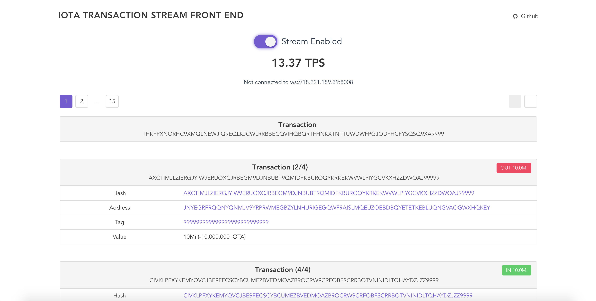

# iota-transaction-stream-front-end

A front end for an [IOTA Transaction Stream](https://www.npmjs.com/package/iota-transaction-stream)



## Build Setup

Set values for these environment variables:

    IOTA_TRANSACTION_STREAM_IP=xxx.xxx.xxx.xxx // defaults to localhost
    IOTA_TRANSACTION_STREAM_PORT=8008 // defaults to 8008
    IS_IOTA_TRANSACTION_STREAM_SECURED=false // false -> ws, true -> wss, defaults to false

Then run with these

``` bash
# install dependencies
npm install

# serve with hot reload at localhost:8080
npm run dev

# build for production with minification
npm run build

# build for production and view the bundle analyzer report
npm run build --report
```

For a detailed explanation on how things work, check out the [guide](http://vuejs-templates.github.io/webpack/) and [docs for vue-loader](http://vuejs.github.io/vue-loader).
